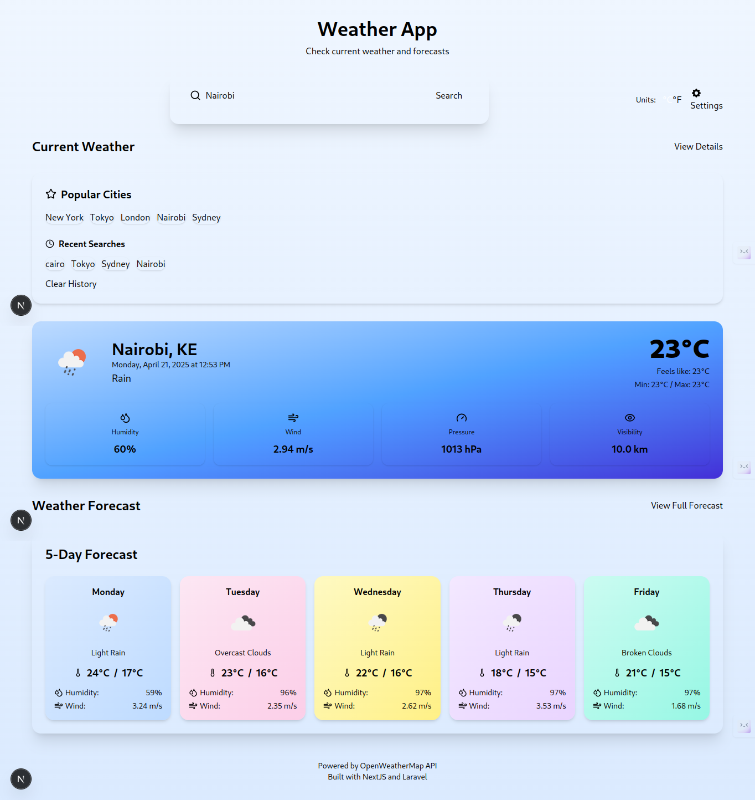
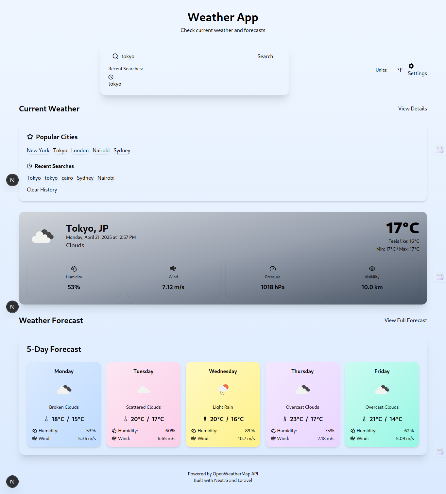
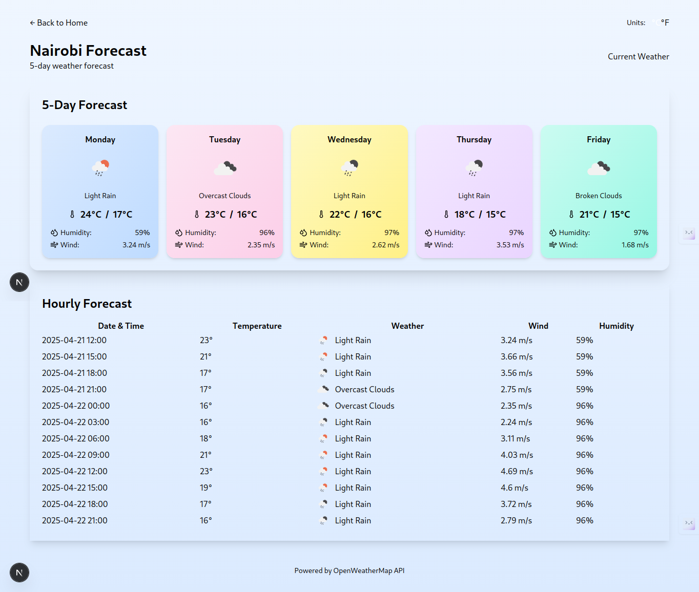

# Weather App

A full-stack weather application with a decoupled architecture using NextJS for the frontend and Laravel for the backend. The app integrates with the OpenWeatherMap API to provide real-time weather data and forecasts.

## Architecture

The application follows a decoupled architecture:
- **Frontend**: NextJS with TypeScript, RippleUI/Tailwind CSS
- **Backend**: Laravel API-only application
- **External API**: OpenWeatherMap

```
Frontend (NextJS) <--> Backend (Laravel) <--> OpenWeatherMap API
```

## Features

- Current weather conditions display
- 5-day weather forecast
- Search by city name
- Unit toggle (Celsius/Fahrenheit)
- Responsive design
- Error handling

## Screenshots





## Technologies Used

### Frontend
- NextJS 13+
- TypeScript
- RippleUI (Tailwind CSS)
- React Context API for state management
- Fetch API for AJAX requests

### Backend
- Laravel 10
- Guzzle HTTP client
- RESTful API design
- Response caching for better performance

## Getting Started

### Prerequisites
- Node.js (v18+)
- PHP 8.1+
- Composer
- OpenWeatherMap API key

### Backend Setup
1. Clone this repository
2. Navigate to the backend folder:
   ```bash
   cd weather-app/backend
   ```
3. Install dependencies:
   ```bash
   composer install
   ```
4. Create a `.env` file based on `.env.example` and add your OpenWeatherMap API key:
   ```
   OPENWEATHER_API_KEY=your_api_key_here
   OPENWEATHER_API_URL=https://api.openweathermap.org/data/2.5
   ```
5. Start the Laravel server:
   ```bash
   php artisan serve
   ```

### Frontend Setup
1. Navigate to the frontend folder:
   ```bash
   cd ../frontend
   ```
2. Install dependencies:
   ```bash
   npm install
   ```
3. Create a `.env.local` file with your backend API URL:
   ```
   NEXT_PUBLIC_API_URL=http://localhost:8000/api
   ```
4. Start the development server:
   ```bash
   npm run dev
   ```
5. Open [http://localhost:3000](http://localhost:3000) in your browser

## API Endpoints

### Get Current Weather
```
GET /api/weather/current?city={cityName}&units={units}
```

### Get Weather Forecast
```
GET /api/weather/forecast?city={cityName}&units={units}&days={days}
```

### Get Weather by Coordinates
```
GET /api/weather/coordinates?lat={latitude}&lon={longitude}&units={units}
```

## Future Improvements
- Add user authentication to save favorite locations
- Implement geolocation to get user's current location
- Add more detailed weather data
- Implement weather maps
- Add weather alerts
- Add unit tests

## License
This project is licensed under the MIT License - see the LICENSE file for details.